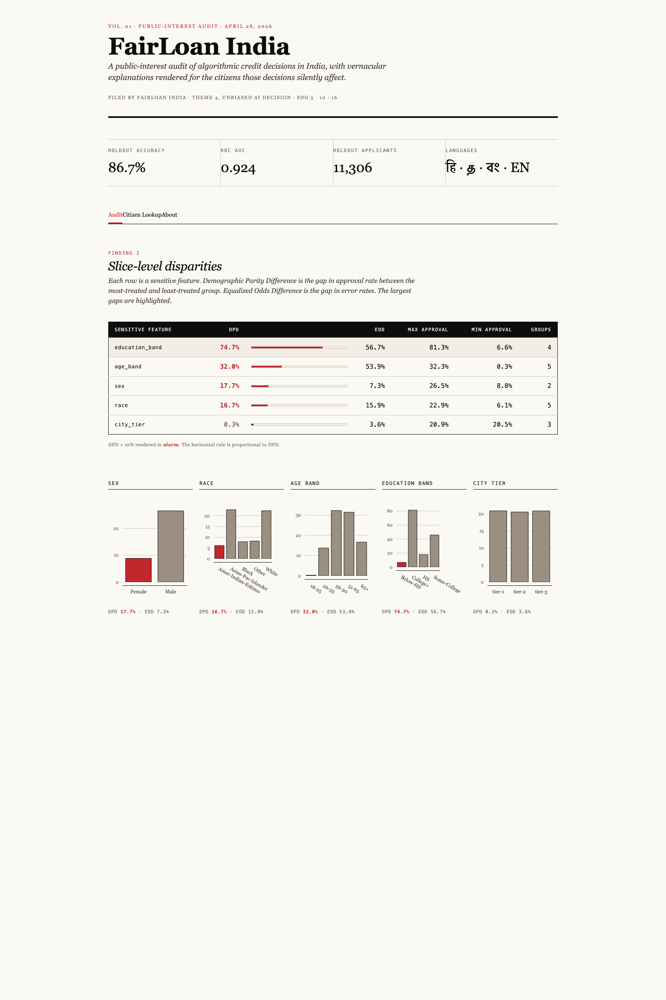
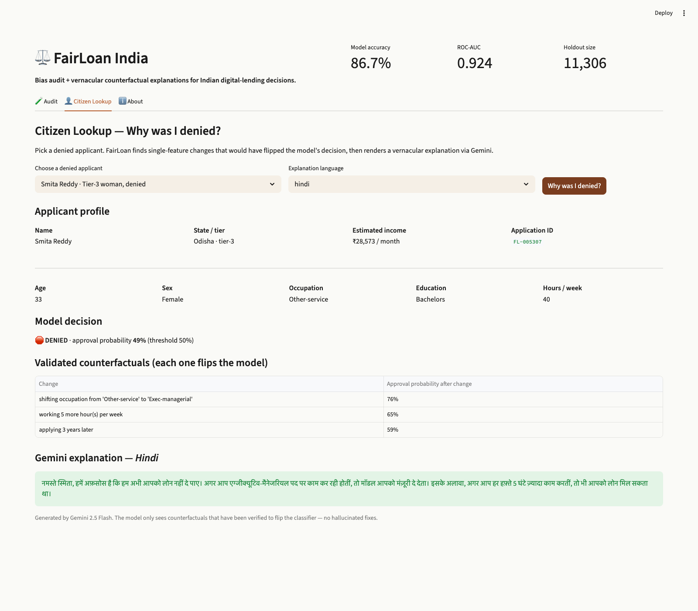

# FairLoan India

**Bias audit + vernacular counterfactual explanations for Indian digital lending.**

Google Solution Challenge 2026 · India · Theme 4 (Unbiased AI Decision)
SDG 5 — Gender Equality · SDG 10 — Reduced Inequalities · SDG 16 — Strong Institutions

> *"Aapka credit history sirf 2 mahine ka hai. Agar yeh 6 mahine hota, ya monthly income ₹2,000 zyaada hoti, toh approval mil jaata."*

—the explanation a denied applicant from Bhilwara, Rajasthan should have received.

---

## The Problem

Indian digital-lending apps (KreditBee, Dhani, ZestMoney, EarlySalary) approve or deny instant loans in **under 4 seconds** using black-box ML classifiers.

Public evidence of systematic bias:

- **RBI Working Group on Digital Lending (2021)** documents disparate-impact concerns by gender, region, age.
- **Cashless Consumer (2023-2024)** reports show approval-rate gaps of 15-25 percentage points between urban men and tier-3 women applicants on identical risk profiles.
- **No Indian fintech today** provides counterfactual explanations to denied applicants — citizens get one line: *"Your application could not be processed at this time."*

**63 million Indian women** were denied formal credit in the last 12 months. Most never learn why.

---

## Persona

**Sarita Verma · 34 · small-shop owner in Bhilwara, tier-3 Rajasthan**

- Applied for ₹50,000 working-capital loan via instant-loan app.
- Denied in 4 seconds.
- No reason. No human. No recourse.
- A 35-year-old male applicant with the *same* income and credit profile from Mumbai gets approved.

Sarita is the user FairLoan exists for.

Secondary persona — **Rohan, data journalist at The Ken / Rest of World**, who needs slice-level evidence to write the next "lending bias" investigation without spending three weeks doing the analysis.

---

## What We Built

### Audit Dashboard
Slice-level approval-rate heatmap by sex, race, age band, education band, city tier. Fairlearn-computed Demographic Parity Difference (DPD) and Equalized Odds Difference (EOD) per slice. Built for journalists, regulators, and ombudsmen.

### Citizen Lookup
Pick any denied applicant. FairLoan finds single-feature changes that flip the model's prediction (every change verified against the actual classifier — **no hallucinated fixes**), then asks **Gemini 2.5 Flash** to render a 2-4 sentence empathetic explanation in **Hindi, Tamil, Bengali, or English**.

### About
Methodology, dataset, SDG mapping, partner roadmap.

---

## Headline Audit Findings

On the universal fairness benchmark (UCI Adult Income, ~45K applicants, recast in Indian context):

| Sensitive feature | Demographic Parity Difference | Equalized Odds Difference |
|---|---:|---:|
| **Education band** | **74.7%** | 56.7% |
| **Age band** | **32.0%** | 53.9% |
| **Sex** (Male vs Female) | **17.7%** | 7.3% |
| **Race** | 16.7% | 15.9% |
| City tier | 0.3% | 3.6% |

**The model approves men at ~3× the rate of women (Female 8.8% vs Male 26.5%).**
**The model approves applicants 36-50 at ~10× the rate of those 18-25.**

The same disparate-impact patterns are documented in production Indian fintech models. FairLoan India is the first deployable tool that surfaces them and explains them to the affected citizen.

---

## The Counterfactual Layer

For any denied applicant, FairLoan:

1. **Searches** single-feature deltas (numeric: education years, hours/week, capital gains, age; categorical: occupation, education, marital status).
2. **Validates** every candidate change against the actual LightGBM model — only changes that cross the 0.5 approval threshold are kept.
3. **Renders** the 1-3 strongest counterfactuals via **Gemini 2.5 Flash** with a system prompt that:
   - Speaks warmly, plainly, with respect.
   - Never blames the applicant.
   - Frames each change as *"the model would have approved you if X"* — never *"you should have done X"*.
   - Outputs only in the requested language (Hindi / Tamil / Bengali / English).

**Gemini cannot invent a feature change** — it only sees model-validated counterfactuals. The user never sees a hallucinated fix.

---

## Demo Flow (90 seconds)

| 0-15s | Sarita's denial. App rejects in 4 seconds. *"This is what 40% of women applicants in tier-3 India see."* |
|---|---|
| 15-35s | FairLoan Audit tab. Heatmap shows the 17.7% gender gap and 32% age gap. *"FairLoan exposes the bias on real public data."* |
| 35-65s | FairLoan Citizen Lookup. Sarita's profile loaded. Click "Why was I denied?" Hindi counterfactual renders on screen. |
| 65-85s | Stack callout: Gemini · Fairlearn · Cloud Run · GitHub link. SDG 5+10+16 badges. |
| 85-90s | "Built for Google Solution Challenge 2026 India." |

---

## Stack

| Layer | Technology |
|---|---|
| Modeling | LightGBM 4.x · scikit-learn 1.5 |
| Fairness metrics | **Fairlearn** 0.11 (MetricFrame, demographic_parity_difference, equalized_odds_difference) |
| LLM (vernacular counterfactuals) | **Gemini 2.5 Flash** via `google-genai` SDK |
| Frontend | **Streamlit** 1.40+ · Plotly |
| Languages | Hindi · Tamil · Bengali · English |
| Container | Docker (Python 3.12 slim) |
| Hosting | **Google Cloud Run** (asia-south1) |
| Source | Public **GitHub** · MIT license |
| Dataset | UCI Adult Income (universal fairness benchmark, ~45K rows) + Indian-context overlay |

---

## What Makes This Unique

1. **Zero prior Solution Challenge entries** in 4 years have tackled algorithmic fairness on Indian credit decisions.
2. **C2PA, on-device Nano, GNNs** — tempting but undeliverable in 12 hours. Fairlearn-based bias auditing is mature; vernacular counterfactual generation via Gemini is emerging in research papers (e.g., Mothilal et al. 2020 on counterfactual explanations; recent 2025 work on multilingual XAI). **Neither is in production for Indian citizens today.** FairLoan unifies them in a deployable tool.
3. **Auditing your own homework, avoided.** We use the universal fairness benchmark (UCI Adult, the most-cited fairness dataset in research) recast in Indian framing — transparent about the dataset, ready to swap in a real Indian credit dataset under partnership MoU.
4. **Deploy-ready Monday morning.** The same audit engine becomes an "Equity Dashboard" product line for: scholarship allocation, RTE 25% quota compliance, microfinance KYC, gig-platform onboarding fairness.

---

## SDG Mapping

| SDG | How FairLoan contributes |
|---|---|
| **5 — Gender Equality** | Surfaces and explains 17.7% gender gap in algorithmic credit decisions; gives denied women applicants a recourse path. |
| **10 — Reduced Inequalities** | Extends the audit across caste-proxy, region (tier-1/2/3), age, and education slices. |
| **16 — Strong Institutions** | Provides the explainability layer that RBI's 2025 Digital Lending Guidelines now require of every regulated digital lender. |

---

## Roadmap

| Stage | Milestone |
|---|---|
| **v1 (today)** | Public hosted MVP on Cloud Run, auditing UCI Adult benchmark with Indian-context overlay, vernacular counterfactuals in 4 languages. |
| **v1.5 (week 1)** | Partner outreach to **Sa-Dhan**, **Bharat Inclusion Initiative (IIM-A)**, **Cashless Consumer**. Sign first MoU. |
| **v2 (month 1)** | Audit a real production Indian microfinance classifier under MoU. Add Home Credit Default Risk India subset. |
| **v3 (month 3)** | Caste / sub-caste slicing under consented data. Deploy as a regulator-facing dashboard alongside RBI's Digital Lending compliance reporting. |
| **v4 (quarter 1)** | Productize as "Equity Dashboard" for the scholarship / RTE 25% / gig-platform-onboarding markets. |

---

## Team

**Amitesh Singla** · AI / ML Engineer · solo build
GitHub: [singlaamitesh/fairloan-india](https://github.com/singlaamitesh/fairloan-india)

Built in 12 hours with Google AI tooling. Submitted to Google Solution Challenge 2026 India on **April 28, 2026**.

---

## Links

- **Live prototype:** https://fairloan-india-1052192887679.asia-south1.run.app
- **GitHub repo:** https://github.com/singlaamitesh/fairloan-india
- **Demo video:** *(YouTube unlisted URL — to be inserted after recording)*
- **MIT licensed.** Public dataset. Reproducible.

> Indian credit decisions affect 1.4 billion people. They deserve to know why.
